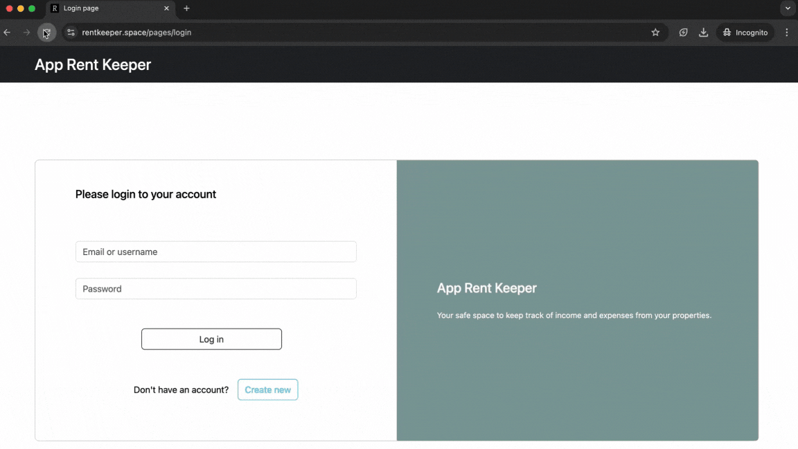

# App Rent Keeper
## Project Overview

This web app is designed for property hosts who rent out on multiple platforms such as Airbnb, Booking, personal websites, etc. It helps in consolidating income and expenses from various sources into a single dashboard. The app provides user-friendly forms for easy financial data management, allowing users to add, edit, and delete financial information with ease.

Try it out: https://rentkeeper.space

## Demo Usage



## Project Structure

The project consists of three microservices:

- **src.operations**: The main application for processing financial data records.
- **src.auth**: Handles user authentication and authorization.
- **src.pages**: Responsible for rendering dynamic web pages using templated content.


## Specifications

Stack used in the project:

**Backend**: Python 3.11, FastAPI, Pydantic, SQLAlchemy 2  
**Authentication**: fastapi-users  
**Database**: PostgreSQL, Alembic migrations  
**Testing**: pytest, pytest-asyncio, httpx  
**Frontend**: JavaScript, HTML, CSS    
**Deployment**: docker-compose, Nginx  


## How to run without Docker

Clone the repository and create a `.env` file in the root directory of the project and add the following content:

```bash
# PostgreSQL Settings
DB_HOST=localhost
DB_PORT=5432
DB_NAME=my_database
DB_USER=postgres
DB_PASS=postgres

# Secret key for fastapi-users
SECRET_AUTH_KEY=Secret_key

# PostgreSQL Test Settings - in case you want to run tests with pytest
DB_HOST_TEST=localhost
DB_PORT_TEST=6000
DB_NAME_TEST=my_test_database
DB_USER_TEST=postgres
DB_PASS_TEST=postgres
```

Run the app using the uvicorn command:

```bash
uvicorn src.main:app --reload
```
By default, the FastAPI app will be accessible at http://localhost:8000.


## How to run with container and nginx (for deployment)

Clone the repository and create a `.env-non-dev` file in the root directory of the project and add the following content:

```bash
# PostgreSQL Settings
DB_HOST=localhost
DB_PORT=1221
DB_NAME=my_database
DB_USER=user_xxx
DB_PASS=secure_password

# Secret key for fastapi-users
SECRET_AUTH_KEY=Secret_key

# PostgreSQL Settings for DB container
POSTGRES_DB=my_database
POSTGRES_USER=user_xxx
POSTGRES_PASSWORD=secure_password
```

Then make sure you have installed Docker, Docker Compose, and Nginx on your server.

Build and run the project with Docker Compose:

```bash
docker compose build
docker compose up
```

This will first run alembic upgrade (through a script `alembic_app.sh`), and build the Docker images for the FastAPI app, PostgreSQL and nginx services, and run all the containers. The configuration in docker-compose.yml assumes that you have already issued an SSL certificate and key, and have copied them to `the /etc/letsencrypt/ssl-copy` directory on your host machine. Check `nginx/nginx.conf` for details.

## Access API documentation:

You can access API documentation, automatically generated by FastAPI and Swagger UI, by visiting:

- https://rentkeeper.space/docs – for the currently deployed version
- http://localhost:8000/docs – by default, if you run the app locally
